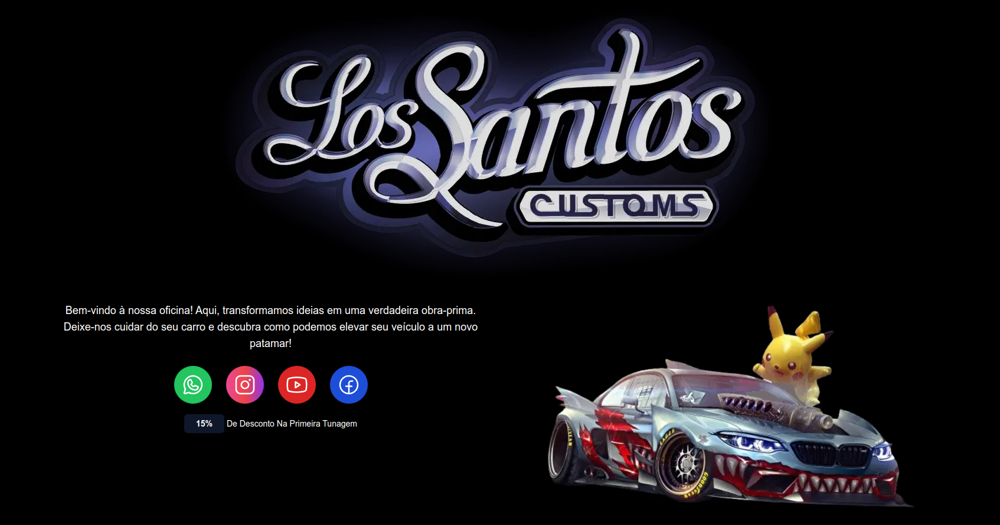
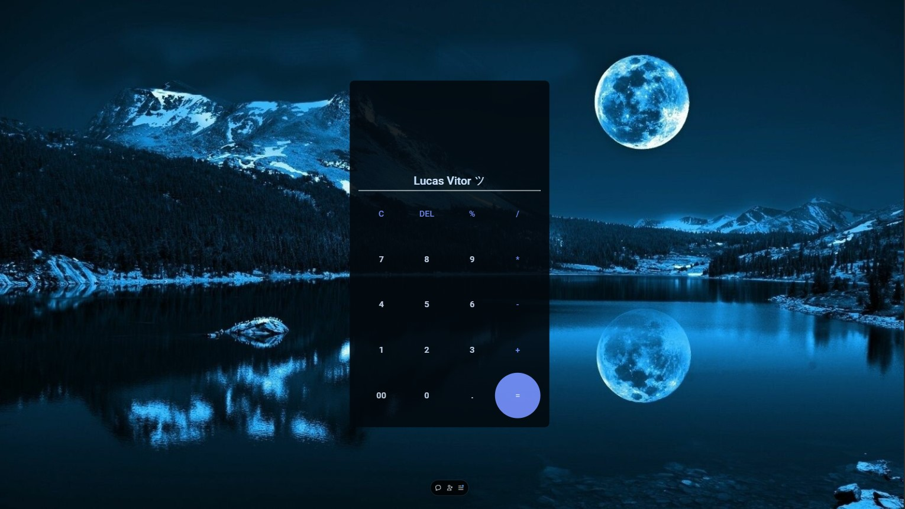

## 🚀 Sobre Mim  
Desde pequeno, sempre fui muito curioso, buscando entender como as coisas funcionam. Essa paixão pelo conhecimento me levou ao mundo da **tecnologia**, onde encontrei minha vocação em desenvolver soluções e aprimorar sistemas.  

Hoje, estou me aprofundando no campo da segurança digital, um tema que me fascina cada vez mais. Acredito que proteger informações e sistemas é fundamental em um mundo tão conectado, e estou ansioso para continuar aprendendo e aplicando meus conhecimentos em novos projetos e desafios.

---

## 🎓 Formação Acadêmica  
📌 **Análise e Desenvolvimento de Sistemas**  
📌 **Cursando Pós-Graduação em Segurança Cibernética**  

---

## 🛠️ Experiência Profissional  
✔️ **Suporte Técnico**  
✔️ **Freelancer**  

---

## 🌐 Projetos Web

Aqui estão alguns dos meus projetos web desenvolvidos para oferecer experiências dinâmicas e interativas. Cada um com uma proposta única para criar algo impactante.

### [Los Santos](https://los-santos-three.vercel.app/)
Esse projeto desenvolvido com **TypeScript**, inspirado na icônica Los Santos Customs do jogo GTA 5.

---

### [Conectados Pela Fé](https://conectados-pela-fe-lucssvittors-projects.vercel.app/)
Projeto pessoal que visa evangelizar jovens.

---

### [Calculadora](https://calculator-eight-lyart.vercel.app/)
Uma calculadora básica desenvolvida para realizar operações matemáticas simples.

---

  

    
    
  

 

  

