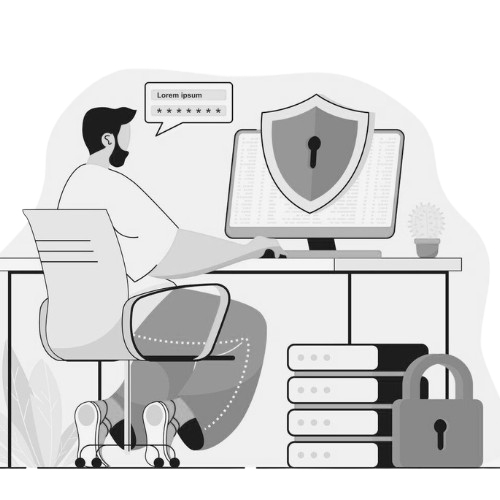

## 🚀 Sobre Mim  
Desde pequeno, sempre fui muito curioso, querendo entender como as coisas funcionavam. Esse desejo de explorar e descobrir como as tecnologias operam me levou a me apaixonar pelo mundo digital.  

Atualmente, estou me aprofundando no campo da **segurança digital**, buscando sempre resolver problemas de forma prática e eficiente. Acredito que proteger informações e sistemas é essencial em um mundo cada vez mais conectado.  

---

## 🎓 Formação  
- **Análise e Desenvolvimento de Sistemas**  
- **Cursando Pós em Segurança Cibernética**  

## 🛠️ Experiência  
- Suporte Técnico  
- Freelancer  

---

## 📬 Vamos conversar?  
📩 Entre em contato e veja mais sobre meu trabalho:  
[📄 Meu Currículo](curriculo/LucasVitor.pdf)

---

### 🌟 Obrigado por visitar meu perfil!  
Sinta-se à vontade para explorar meus repositórios e contribuir com ideias! 🚀  
